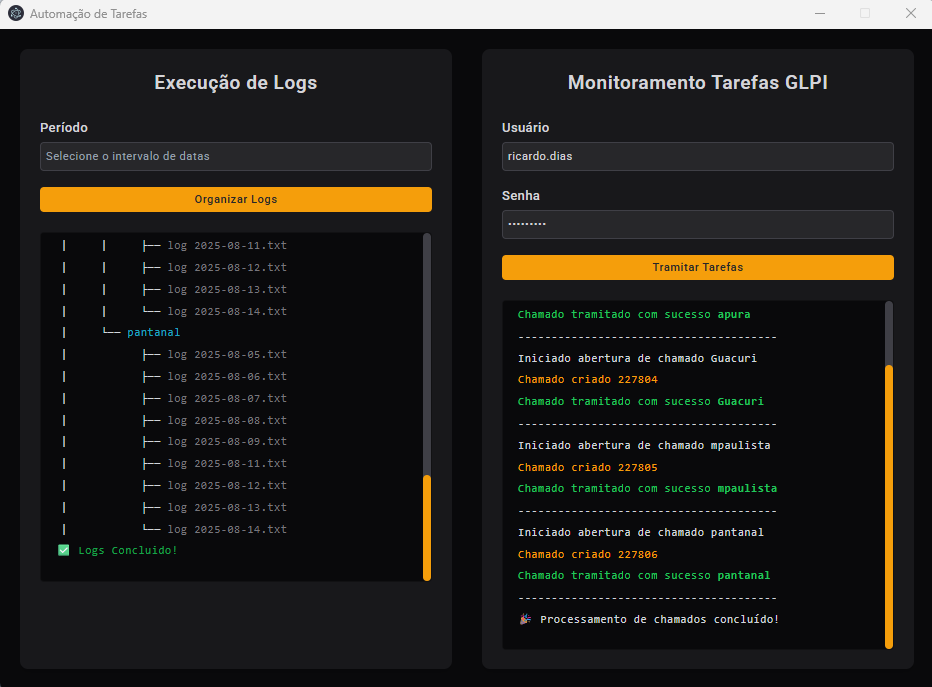

# ANALISE DE LOGS INFRA

 <!-- Placeholder for a banner image; replace with actual if available -->

## Descrição

A **ANALISE DE LOGS INFRA** é uma solução de backend poderosa e automatizada, para revolucionar o monitoramento de logs de backup em servidores distribuídos por múltiplas unidades organizacionais. Imagine o desafio anterior: volumes massivos de dados, com logs de mais de 3.000 linhas por servidor, exigindo análise manual exaustiva. Equipes de TI dedicavam horas preciosas revisando arquivos unidade por unidade – totalizando 53 unidades – identificando sucessos e erros, abrindo chamados no GLPI para registrar evidências e tratar falhas. Um processo repetitivo, propenso a erros humanos e ineficiente, que consumia tempo valioso que poderia ser investido em inovações estratégicas.

Agora, esta aplicação transforma esse fluxo em uma orquestração inteligente e sem esforço. O usuário simplesmente seleciona um intervalo de datas semanal (ex.: de segunda a domingo), inicia o processo, e o sistema assume o controle: lê e processa logs de todos os servidores das unidades de forma centralizada, padroniza o conteúdo por data, horário e status (sucesso ou erro), e organiza tudo em estruturas lógicas. Em seguida, com as credenciais do GLPI fornecidas pelo usuário, a aplicação automatiza a abertura de chamados para cada unidade – anexando logs evidenciados de sucessos e erros. Chamados com apenas sucessos são encerrados automaticamente como "concluídos", enquanto aqueles com erros permanecem abertos, alertando a equipe de TI para investigação e resolução proativa.

Com suporte a execução local via executável empacotado (usando ferramentas como pkg), essa ferramenta roda independentemente na máquina do usuário, promovendo portabilidade e segurança em ambientes restritos. É como um "maestro digital" que harmoniza o caos de dados dispersos em ações acionáveis, garantindo conformidade em auditorias, reduzindo downtime e elevando a eficiência operacional para novos patamares. Extensível para outros cenários de logs, como monitoramento de desempenho ou segurança, esta solução pavimenta o caminho para uma infraestrutura verdadeiramente autônoma.

## Objetivo

O foco principal desta aplicação é eliminar o gargalo da análise manual de logs de backup, automatizando um processo que antes demandava intervenção humana intensiva em 53 unidades. Especificamente:

- **Automação de Seleção e Processamento**: Permitir que o usuário defina um intervalo semanal de datas, processe logs volumosos (milhares de linhas por servidor) de múltiplas unidades de uma só vez, e organize-os por critérios de data, horário e status – liberando equipes de tarefas tediosas.
- **Integração Inteligente com GLPI**: Após o processamento, usar credenciais fornecidas para abrir chamados por unidade, anexar evidências de logs (sucessos e erros), e gerenciar o ciclo de vida: fechamento automático para sucessos puros e manutenção aberta para erros, facilitando tratamentos rápidos pela equipe de TI.
- **Evidências para Auditoria e Conformidade**: Gerar registros semanais automatizados, comprovando a integridade dos backups e mitiga riscos de não-conformidade, com histórico auditável de todos os 53 ambientes.
- **Eficiência e Escalabilidade**: Reduzir drasticamente o tempo gasto – de horas manuais por unidade para minutos automatizados no total – permitindo foco em resoluções estratégicas, como otimização de backups ou predição de falhas via análise avançada.

Em resumo, o projeto empodera profissionais de TI a transcenderem o operacional rotineiro, fomentando uma cultura de automação que transforma desafios em oportunidades de crescimento.

## Funcionalidades Principais

- **Seleção de Intervalo Semanal**: Interface simples para o usuário definir datas (ex.: início e fim da semana), filtrando logs relevantes de servidores em 53 unidades.
- **Leitura e Padronização Automatizada**: Escaneia pastas configuráveis, processa logs extensos (>3.000 linhas por arquivo), e categoriza por data, horário, sucesso (baseado em palavras-chave como "OK" ou "Completed") e erro (ex.: "Failed" ou "Exception").
- **Organização Pós-Processamento**: Agrupa logs por unidade, criando estruturas organizadas para fácil anexação e revisão, eliminando a necessidade de análise manual inicial.
- **Integração com GLPI via Credenciais Dinâmicas**:
  - Após processamento, solicita credenciais do usuário e abre chamados automatizados para cada uma das 53 unidades.
  - Anexa logs evidenciados: sucessos para registro rápido; erros para destaque e tratamento.
  - Fluxo inteligente: Encerramento automático de chamados sem erros (status "concluído"); manutenção aberta para chamados com falhas, notificando a equipe de TI para resolução.
- **Configurações via .env**: Definição flexível de URL do GLPI, caminhos de pastas de logs, credenciais (inseridas runtime para segurança), e critérios de filtragem.
- **Execução Local e Empacotamento**: Geração de executáveis standalone via pkg, permitindo rodar offline na máquina do usuário – ideal para ambientes com 53 unidades distribuídas.
- **Extensibilidade Criativa**: Suporte a integrações futuras, como dashboards web para visualização agregada ou alertas em tempo real via e-mail/webhook para erros críticos em unidades específicas.

## Tecnologias Utilizadas

- **Backend Principal**: Node.js, com ênfase em processamento assíncrono para lidar com volumes altos de dados de múltiplas unidades.
- **Manipulação de Arquivos e Dados**: Módulos nativos como `fs` e `path`, aliados a `dotenv` para configurações seguras.
- **Integração GLPI**: API REST ou similar, com autenticação dinâmica baseada em credenciais runtime.
- **Empacotamento**: `pkg` para criação de executáveis multiplataforma, garantindo portabilidade.

## Instalação

1. **Pré-Requisitos**:
   - Node.js (versão 14+ recomendada).
   - Acesso a uma instância GLPI com API habilitada.
   - Pastas de logs acessíveis, contendo arquivos de backups das 53 unidades.

2. **Clonando o Repositório**:
   ```
   git clone https://github.com/RicardoTavaresDias/ANALISE-DE-LOGS-INFRA.git
   cd ANALISE-DE-LOGS-INFRA
   ```

3. **Instalando Dependências**:
   ```
   npm install
   ```

4. **Configuração**:
   - Crie um arquivo `.env` com bases como:
    ```env
    PORT=3333
    URL=http://localhost:3333
    navegador do Puppeteer true fica a mostra ou false fica minimizado o navegador
    OFFBROWSER=true
    PATCHFILE=.\unidade
    ```
   - Nota: Credenciais GLPI são inseridas runtime para maior segurança; não armazene no .env.

5. **Executando a Aplicação**:
   - Para desenvolvimento:
    ```
    npm run dev 
    ```
   - Para produção:
    ```
    npm run build  # Gera executável
    ```

## Uso

1. **Início do Processo**: 
  
     Rode o executável ou script. Selecione o intervalo semanal de datas (ex.: 2023-09-04 a 2023-09-10).
2. **Processamento de Logs**: 

     O sistema lê e organiza logs de todas as 53 unidades automaticamente, lidando com volumes extensos sem intervenção.
3. **Integração GLPI**: 

   Forneça credenciais quando solicitado; a aplicação abre e gerencia chamados por unidade – fechando sucessos e deixando erros abertos.
4. **Exemplo de Fluxo Semanal**: 

    Para depuração, verifique logs em `./tmp` ou consulte o código em `src/`.


## Contato

- **Equipe**: Infraestrutura – Ricardo Tavares Dias
- **GitHub**: [RicardoTavaresDias](https://github.com/RicardoTavaresDias)
- **Issues**: [Abrir Issue](https://github.com/RicardoTavaresDias/ANALISE-DE-LOGS-INFRA/issues)

© 2025 – Automatizando eficiência, liberando criatividade em TI.